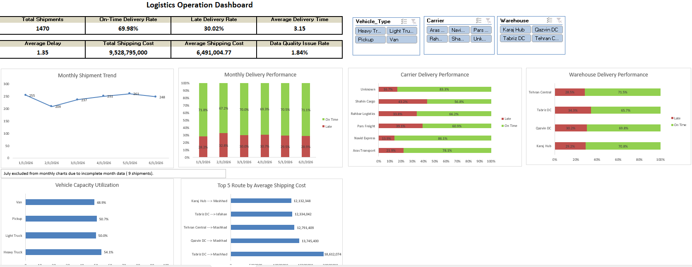

# Logistics Operations Analysis

## Project Overview

This project simulates a real-word logistics operations analysis workflow using Python, Pandas, and Excel.

The project covers the complete process from raw shipment data inspection and cleaning to business validation, KPI analysis, automated Excel reporting, PivotTables, and an interactive management dashboard.

The analysis focuses on delivery performance, carrier and warehouse performance, transportation costs, vehicle utilization, route performance, monthly trends, and fdata quality.

## Project Workflow

Raw Data --> Data Inspection --> Data Cleaning & Validation --> KPI Analysis --> Excel Reporting --> PivotTables --> Interactive Dashboard

## Tools & Technologies

- Python
- Pandas
- OpenPyXL
- Microsoft Excel
- Power Query
- PivotTables & PivotCharts

## Key KPIs & Analysis

- Total Shipments: 1,470
- On-Time Delivery Rate: 69.98%
- Late Delivery Rate: 30.02%
- Average Delivery Time: 3.15 days
- Average Delay: 1.35 days
- Total Shipping Cost: 9,528,795,000
- Average Shipping Cost: 6,491,004.77
- Data Quality Issue Rate: 1.84%

The project also analyzes performance by carrier, warehouse, vehicle type, route, and month, including vehicle capacity utilization and transportation cost performance.

## Interactive Dashboard

The Excel dashboard provides an interactive management view of logistics performance, including:

- KPI cards for key operational metrics
- Monthly shipment and delivery performance trends
- Carrier and warehouse delivery performance
- Vehicle capacity utilization
- Top routes by average shipping cost
- Interactive slicers for Carrier, Warehouse, and Vehicle Type
- Power Query connection for refreshing processed data after Python updates

### Dashboard Preview

## Key Insights

- Overall on-time delivery performance was approximately 70%, while about 30% of valid deliveries were late.
- Carrier performance varied considerably, with on-time delivery rates ranging from approximately 57% to 86%.
- Tabriz DC had the highest average shipping cost among warehouses, indicating a need for further route and distance-level investigation.
- Vehicle capacity utilization averaged around 49%–54% across vehicle types.
- Only 1.84% of shipments contained identified data quality issues.
- July contained only 9 shipments and was treated as an incomplete month, so it was excluded from the main monthly dashboard charts.

## Project Structure

Logistics_Operations_Analysis/
│
├── data/
│ ├── raw/
│ │ └── logistics_shipments_raw.csv
│ └── processed/
│ └── logistic_shipments_clean.csv
│
├── src/
│ ├── data_inspection.py
│ ├── data_cleaning.py
│ └── logistic_analysis.py
│
├── output/
│ ├── logistics_operations_report.xlsx
│ └── logistics_operations_dashboard.xlsx
│
│──.gitignore
│──requirements.txt
└── README.md

## How to Run

1. Run `data_inspection.py` to inspect the raw logistics data and identify data quality issues.
2. Run `data_cleaning.py` to clean and validate the raw data and generate the processed dataset.
3. Run `logistic_analysis.py` to calculate KPIs and generate `logistics_operations_report.xlsx`.
4. Open `logistics_operations_dashboard.xlsx` in Microsoft Excel.
5. On first use, update the Power Query source path to the local 'output/logistics_operations_report.xlsx' file.
6. Select **Data -> Refresh All** to refresh the Power Query connection, PivotTables, PivotCharts, KPI cards, and dashboard.
7. Use the Carrier, Warehouse, and Vehicle Type slicers to interactively analyze logistics performance.